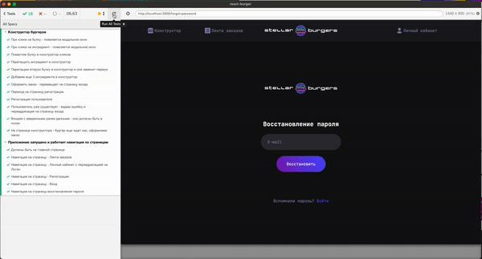

## sprint-3/step-3

###Исправлен механизм обновления токена через refresh token.
Использован axios interceptor src/utils/http.js - и все запросы требующие авторизацию проводим через него.

```
const http = axios.create();
http.defaults.headers.common = { Authorization: 'Bearer token' };
```

При полученном коде ответа `401` или `403` - пробует обновить accessToken через refreshToken.

> [http.js](src/utils/http.js) - экспортируемый модуль.

### Написаны unit тесты для основной логики приложения

```
 PASS  src/services/slices/login.test.js
 PASS  src/services/slices/auth.test.js
 PASS  src/components/app-header/app-header.test.js
 PASS  src/services/slices/feed.test.js
 PASS  src/services/reducers/ingredient-detail.test.js
 PASS  src/services/slices/ingredients.test.js
 PASS  src/services/reducers/index.test.js
 PASS  src/services/reducers/order.test.js
 PASS  src/services/reducers/ingredient-dragging.test.js
 PASS  src/services/reducers/burger-constructor.test.js

Test Suites: 10 passed, 10 total
Tests:       83 passed, 83 total
Snapshots:   0 total
Time:        7.655 s, estimated 8 s
```

> npm run test - запуск тестов
>
> npm run test-coverage - запуск тестов с покрытием (100% покрыты redux экшены и редюсеры)

### Написаны e2e тесты для постраничной навигации и конструктора бургеров

> npm run test-e2e


